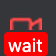

<p>
  <h1>RepSteps Recorder</h1>
</p>

## 👀 Overview

RepSteps Recorder is a Chrome extension that records your browser interactions and generates replication steps. Install it from the [Chrome Webstore]() to get started!

This project builds on existing open source projects (see [Credits](#-credits)) but adds extensibility, configurability and a smoother UI. For more information, please check our [documentation]().

<br>

## 🏗️ What you can do?

- Records clicks and type events.
- Records navigation 
- Generates replication steps list.
<!-- - Take full page and element screenshots. -->
- Pause, resume and restart recording.
- Persist latest script in your browser
- Copy to clipboard.
- Flexible configuration options and dark mode support.

#### Recorded Events
  - `click`
  - `dblclick`
  - `change`
  - `keydown`
  - `select`
  - `submit`
  - `load`
  - `unload`

<br>

## 🔧 How to use?

1. Click the icon and hit the red button.
2. 👉 Hit <kbd>Enter/Return</kbd> after you finish typing in an `input` element. 👈
3. Click on links, inputs and other elements.
4. Wait for full page load on each navigation.

    **The icon will switch from 
    to  to indicate it is ready for more input from you.**

5. Click Pause when you want to navigate without recording anything. Hit Resume to continue recording.

### ⌨️ Shortcuts

- `alt + k`: Toggle overlay
- `alt + shift + F`: Take full page screenshot
- `alt + shift + E`: Take element screenshot

<br>

## 🖥️ Run Locally

After cloning the project, open the terminal and navigate to project root directory.

```bash
$ npm i # install dependencies

$ npm run serve # run development mode

$ npm run test # run test cases

$ npm run lint # run and fix linter issues

$ npm run build # build and zip for production
```

<br>

## 🧩 Install Locally

1. Open chrome and navigate to extensions page using this URL: [`chrome://extensions`](chrome://extensions).
1. Make sure "**Developer mode**" is enabled.
1. Click "**Load unpacked extension**" button, browse the `repSteps-recorder/dist` directory and select it.

<br>

## 🙏 Credits

RepSteps recorder is inspired and heavily influenced by Checkly's [Headless Recorder](https://github.com/checkly/headless-recorder)

<br>


